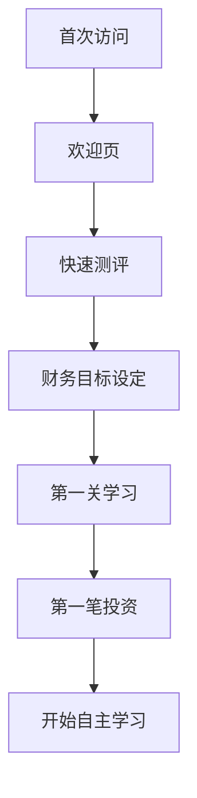
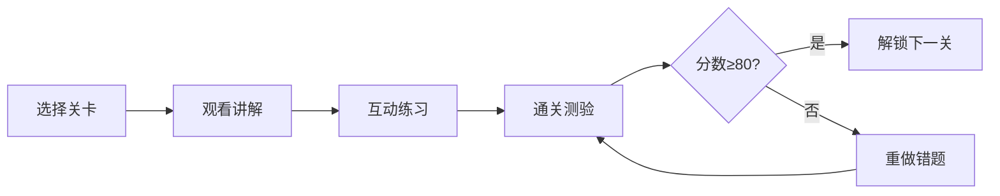
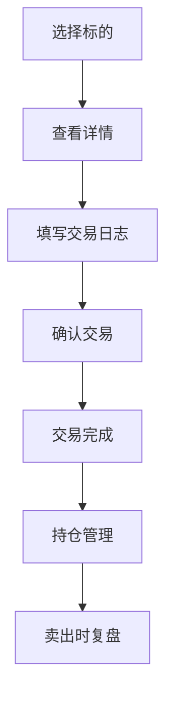

# 设计系统

钱途的UI/UX设计规范和用户体验流程。

## 🎨 设计原则

### 温暖友好
使用温暖色系(橙色系),降低金融的冰冷感,让理财学习变得亲切可及

### 简洁直观
零基础用户友好,界面清晰,操作简单,一看就懂

### 游戏化体验
闯关、升级、徽章等游戏元素,让学习像玩游戏一样有趣

### 即时反馈
每个操作都有明确反馈,让用户知道"发生了什么"

---

## 🎨 配色方案

### 主色调 (温暖橙)

```css
--primary-orange: #FF6F00;
--primary-orange-light: #FF8F00;
--primary-orange-dark: #E65100;
```

**使用场景**:
- 主要按钮
- 重要提示
- 进度条
- 徽章奖励

### 辅助色

```css
--accent-deep-orange: #FF5722;
--success-green: #4CAF50;
--warning-yellow: #FF9800;
--danger-red: #F44336;
--info-blue: #2196F3;
```

### 中性色

```css
--gray-50: #FAFAFA;
--gray-100: #F5F5F5;
--gray-300: #E0E0E0;
--gray-500: #9E9E9E;
--gray-700: #616161;
--gray-900: #212121;
```

---

## 📐 布局规范

### 栅格系统

- **容器宽度**: 最大1280px
- **列数**: 12列
- **间距**: 16px/24px/32px
- **断点**:
  - Mobile: <768px
  - Tablet: 768px-1024px
  - Desktop: >1024px

### 间距系统

```
4px  - xs (微小间距)
8px  - sm (小间距)
16px - md (标准间距)
24px - lg (中等间距)
32px - xl (大间距)
48px - 2xl (超大间距)
```

---

## 🔤 字体规范

### 字体家族

```css
--font-family-base: 'Noto Sans SC', 'PingFang SC', 'Microsoft YaHei', sans-serif;
--font-family-code: 'Roboto Mono', 'Courier New', monospace;
```

### 字号层级

| 层级 | 字号 | 行高 | 用途 |
|------|------|------|------|
| H1 | 32px | 1.2 | 页面主标题 |
| H2 | 24px | 1.3 | 区块标题 |
| H3 | 20px | 1.4 | 小标题 |
| Body | 16px | 1.5 | 正文 |
| Small | 14px | 1.4 | 辅助文字 |
| Tiny | 12px | 1.3 | 标签/说明 |

---

## 🧩 组件库

### 按钮

**主要按钮** (Primary Button):
```
背景: 橙色渐变
文字: 白色
圆角: 8px
悬停: 向上移动2px + 阴影
```

**次要按钮** (Secondary Button):
```
背景: 透明
边框: 橙色1px
文字: 橙色
悬停: 背景浅橙色
```

### 卡片

```
背景: 白色
边框: 1px #E0E0E0
圆角: 8px
阴影: 0 2px 8px rgba(0,0,0,0.08)
悬停: 阴影加深 + 向上2px
```

### 进度条

```
底色: #F5F5F5
填充: 橙色渐变
高度: 8px
圆角: 4px
动画: 平滑过渡
```

### 徽章

```
形状: 圆形/盾形
大小: 64x64px
阴影: 0 4px 12px rgba(255,111,0,0.3)
动画: 获得时缩放+闪烁
```

---

## 🎭 交互动效

### 基础动效

- **持续时间**: 200-300ms (快速操作) / 400-500ms (页面转场)
- **缓动函数**: ease-out (按钮) / ease-in-out (页面)
- **触发时机**: hover / click / scroll

### 常用动效

**悬停效果**:
```css
transition: all 0.3s ease;
transform: translateY(-2px);
box-shadow: 0 4px 12px rgba(255,111,0,0.15);
```

**点击反馈**:
```css
transform: scale(0.95);
transition: transform 0.1s ease;
```

**加载动画**:
```css
@keyframes spin {
  to { transform: rotate(360deg); }
}
```

---

## 📱 响应式设计

### Mobile First

先设计移动端,再适配桌面端

### 断点策略

```css
/* Mobile */
@media (max-width: 767px) {
  /* 单列布局 */
  /* 大号按钮(48px高) */
  /* 底部导航 */
}

/* Tablet */
@media (min-width: 768px) and (max-width: 1023px) {
  /* 2列布局 */
  /* 侧边栏可收起 */
}

/* Desktop */
@media (min-width: 1024px) {
  /* 多列布局 */
  /* 完整导航 */
  /* hover效果 */
}
```

---

## 🌊 用户流程

### 新手引导流程



### 学习流程



### 交易流程



[查看完整用户流程 →](user-flow.md){ .md-button }

---

## 🎯 关键页面设计

### 首页

**布局**:
- Hero区: 品牌slogan + CTA
- 核心价值: 3个特色卡片
- 学习路径: 4阶段流程图
- 用户评价: 滚动展示

### 课程页

**布局**:
- 左侧: 课程地图(可收起)
- 中间: 学习内容区
- 右侧: 进度 + AI导师(可收起)

### 模拟交易页

**布局**:
- 顶部: 账户总览
- 左侧: 持仓列表
- 中间: K线图 + 操作面板
- 右侧: 交易日志

---

## 📋 设计检查清单

### 可用性

- ✅ 所有操作有明确反馈
- ✅ 错误提示清晰易懂
- ✅ 重要操作需二次确认
- ✅ 支持键盘导航

### 可访问性

- ✅ 对比度≥4.5:1
- ✅ 支持屏幕阅读器
- ✅ 支持文字缩放
- ✅ 表单label完整

### 性能

- ✅ 图片压缩优化
- ✅ 懒加载非首屏内容
- ✅ 代码分割
- ✅ CDN加速

---

## 🎨 设计资源

### Figma文件

- 设计系统组件库
- 高保真原型
- 图标库
- 插画素材

### 图标

- 使用Material Icons
- 自定义投资相关图标
- SVG格式,支持多色

### 插画

- 扁平化风格
- 温暖色系
- 场景化设计

---

## 📚 相关文档

- [设计系统详细规范](design-system.md)
- [用户流程图](user-flow.md)

---

**设计理念**: 让理财学习变得简单、有趣、有温度

**设计工具**: Figma + Adobe Illustrator  
**设计师**: 待招募
