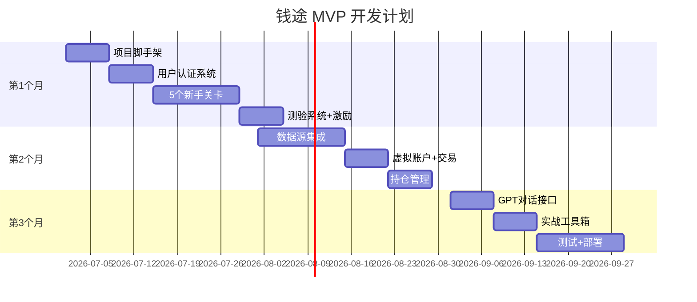
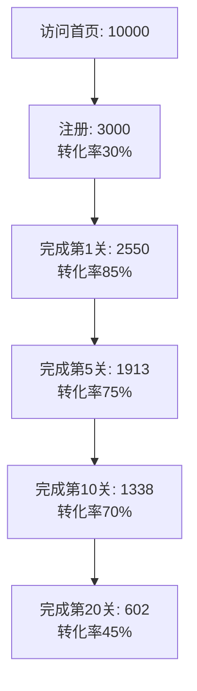

# 运营规划

钱途的运营策略、成本预算和增长计划。

## 📅 MVP开发计划

### 3个月时间线



[查看详细MVP计划 →](mvp-plan.md){ .md-button .md-button--primary }

---

## 💰 成本预算

### 运营成本 (月度)

| 项目 | 规格 | 费用 | 说明 |
|------|------|------|------|
| 云服务器 | 2核4G ECS | ¥100 | 阿里云按量付费 |
| PostgreSQL | 自建 | ¥0 | 服务器自带 |
| Redis | 自建 | ¥0 | 服务器自带 |
| AI调用 | GPT-4o-mini | ¥500 | 估算5000次/月 |
| 域名+SSL | .com域名 | ¥30 | 年付分摊 |
| CDN | 阿里云 | ¥20 | 按流量 |
| **月度合计** | - | **¥650** | - |

**年度成本**: ¥7,800

### 成本优化

- **服务器**: 月付改年付可节省15%
- **AI调用**: 用户量<1000时可控制在¥300/月
- **CDN**: 静态资源压缩可降低40%流量

[查看详细预算 →](budget.md){ .md-button }

---

## 📈 增长策略

### 冷启动 (前3个月)

**目标**: 获取种子用户1000人

**策略**:
1. **内容营销**
   - 小红书: 发布理财小白避坑指南
   - B站: 制作理财入门系列视频
   - 知乎: 回答理财相关问题,引流

2. **社群运营**
   - 建立微信社群
   - 每周线上分享会
   - 邀请奖励机制

3. **KOL合作**
   - 理财博主体验推荐
   - 互推合作

### 成长期 (3-12个月)

**目标**: 月活用户10000+

**策略**:
1. **SEO优化**
   - 理财知识库建设
   - 长尾关键词布局

2. **用户转介绍**
   - 邀请好友奖励
   - 学习小组功能

3. **付费推广**
   - 信息流广告(预算¥5000/月)
   - 搜索引擎SEM

[查看详细增长策略 →](growth-strategy.md){ .md-button }

---

## 🎯 运营目标

### 第1季度 (MVP上线)

| 指标 | 目标值 |
|------|--------|
| 注册用户 | 1,000 |
| 月活用户 | 500 |
| 完课率 | 30% |
| 日均活跃 | 50 |
| 用户留存(7日) | 40% |

### 第2季度 (用户增长)

| 指标 | 目标值 |
|------|--------|
| 注册用户 | 5,000 |
| 月活用户 | 2,500 |
| 完课率 | 35% |
| 日均活跃 | 200 |
| 用户留存(7日) | 45% |

### 第3-4季度 (商业化探索)

| 指标 | 目标值 |
|------|--------|
| 注册用户 | 20,000 |
| 月活用户 | 10,000 |
| 完课率 | 40% |
| 付费用户 | 500 |
| 月收入 | ¥50,000 |

---

## 💼 商业模式

### 当前: 免费MVP

- 所有核心功能免费
- 积累用户和数据
- 验证产品价值

### 未来: 增值服务 (V2.0)

**付费项目**:
1. **高级课程** (¥99/季度)
   - 进阶投资策略
   - 行业分析方法
   - 海外资产配置

2. **专家问答** (¥19/次)
   - 真人理财师1对1
   - 30分钟深度咨询

3. **数据服务** (¥49/月)
   - 实时行情推送
   - 估值提醒
   - 定制化报告

4. **企业版** (¥9,999/年)
   - 员工理财培训
   - 定制课程内容
   - 数据看板

### 备选: B2B2C

与券商、银行合作,作为客户教育工具

---

## 📊 数据指标

### 核心指标

- **DAU**: 日活跃用户
- **MAU**: 月活跃用户
- **留存率**: 次日/7日/30日留存
- **完课率**: 完成20关的用户比例
- **ARPU**: 平均每用户收入

### 漏斗分析



### 增长模型

**病毒系数K值**:
```
K = 邀请率 × 转化率
目标K值 > 1 (自增长)
```

---

## 🎨 内容运营

### 内容矩阵

| 平台 | 内容类型 | 频率 | 目标 |
|------|---------|------|------|
| 小红书 | 理财避坑指南 | 3篇/周 | 引流+品牌 |
| B站 | 视频教程 | 1条/周 | 深度内容 |
| 知乎 | 问答+文章 | 5篇/周 | SEO+引流 |
| 微信公众号 | 深度文章 | 2篇/周 | 用户留存 |
| 社群 | 每日早报 | 1条/天 | 活跃+粘性 |

### 内容策略

- **痛点内容**: "为什么你存了10年钱还是买不起房?"
- **避坑指南**: "理财小白必须知道的5个坑"
- **工具教学**: "手把手教你用复利计算器"
- **成功案例**: "90后小白3年攒够10万旅行基金"

---

## 👥 用户运营

### 生命周期管理

**新用户 (0-7天)**:
- 欢迎消息+新手任务
- 前3关引导
- 48小时卡关救援

**活跃用户 (7-30天)**:
- 学习进度提醒
- 挑战任务推送
- 社群活动邀请

**沉默用户 (30天+未登录)**:
- 召回推送: "你的财务目标还记得吗?"
- 优惠券激励
- 新功能通知

**流失用户**:
- 问卷调研
- 改进产品

### 用户分层

- **核心用户**: 完课率高,活跃度高,付费意愿强
- **普通用户**: 完成部分课程,偶尔登录
- **潜在流失**: 注册后未完成第1关

---

## 🔍 竞品分析

### 主要竞品

| 产品 | 定位 | 优势 | 劣势 |
|------|------|------|------|
| 蚂蚁财富 | 理财平台 | 用户量大,产品丰富 | 教育薄弱,直接卖产品 |
| 雪球 | 投资社区 | 内容丰富,社区活跃 | 新手门槛高 |
| 有知有行 | 长期投资教育 | 内容优质,理念好 | 缺少游戏化,互动弱 |

### 钱途的差异化

- ✅ **游戏化学习**: 闯关模式,降低门槛
- ✅ **无风险实践**: 模拟交易,真实数据
- ✅ **AI私教**: 24/7智能答疑
- ✅ **工具集成**: 计算器+模拟器深度集成

---

## 📞 合作机会

### 潜在合作方

1. **券商/银行**: 客户教育工具
2. **企业HR**: 员工福利培训
3. **高校**: 财商教育课程
4. **理财KOL**: 内容合作

### 合作模式

- **流量合作**: 互推引流
- **内容授权**: 课程授权使用
- **定制开发**: 企业版定制
- **分成合作**: 收入分成

---

## 📚 相关文档

- [MVP开发详细计划](mvp-plan.md)
- [成本预算明细](budget.md)
- [增长策略详解](growth-strategy.md)

---

**运营理念**: 用户第一,数据驱动,持续迭代

**当前阶段**: MVP开发中  
**预计上线**: 2026年9月
