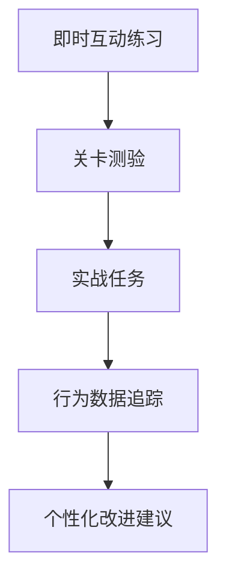

# 实践系统

钱途不只是教你理论知识,更重要的是通过**三层实践体系**帮你真正掌握投资技能。

## 🎯 三层实践体系



---

## 第一层: 即时互动练习

### 课内互动

每关包含1-3个互动练习,即学即练:

| 互动类型 | 示例 | 作用 |
|---------|------|------|
| 计算器 | 复利计算、应急金自测 | 具象化抽象概念 |
| 选择题 | 场景判断、决策模拟 | 训练实战思维 |
| 拖拽匹配 | 资产类别配对 | 加深记忆 |
| 模拟器 | 定投回测、危机模拟 | 体验真实感受 |

**关键设计**: 不允许跳过,必须完成才能继续

---

## 第二层: 关卡测验

### 测验设计

每关结束有3-5道测验题:

- **题型**: 单选题为主,场景题为辅
- **难度**: 80%考查核心概念,20%考查应用
- **通过标准**: ≥80分通关
- **重考机制**: <80分可重做错题(不是全部重考)

### 示例测验

!!! question "关卡2:复利测验"
    **小李25岁,每月存1000元投资,年化8%,到35岁会有多少钱?**
    
    A. 12万元  
    B. 15万元  
    C. 18万元 ✅  
    D. 20万元
    
    **解析**: 使用复利公式FV = PMT × [(1+r)^n - 1] / r,计算得约18.3万元

---

## 第三层: 实战任务

### 模拟交易系统

**虚拟账户**:
- 初始资金: 10万虚拟币
- 数据源: 真实A股行情(akshare)
- 交易规则: 与真实市场一致
- 重置机制: 可随时重置账户

### 交易日志 (强制填写)

**买入时填写**:
- **前3笔**: 至少20字 + AI智能建议辅助
- **第4笔起**: 至少30字,独立填写

**AI智能建议示例**:

```
【AI建议】
投资标的: 沪深300ETF
投资理由:
1. 学习了关卡2复利原理,希望通过长期持有指数基金获得市场平均收益
2. 关卡5学到分散投资,沪深300覆盖中国最大300家公司,风险分散
3. 关卡10.5学到成本重要性,ETF管理费仅0.5%,适合长期持有

止盈计划: 年化收益达到10%或持有满1年时考虑止盈
止损计划: 亏损超过20%时重新评估投资逻辑

[ 直接使用 ] [ 修改后使用 ] [ 我自己写 ]
```

**卖出时填写**:
- 卖出原因
- 实际收益率
- **计划vs实际对比**: 是否按计划执行?偏离原因?

### 挑战任务

| 任务 | 目标 | 验收标准 | 奖励 |
|------|------|---------|------|
| 30天定投 | 体验定投策略 | 交易≥4笔,每笔间隔5-10天 | 200经验值 |
| 资产配置 | 实践分散投资 | 持有≥3种资产,股债比6:4左右 | 150经验值 |
| 危机生存 | 测试心理韧性 | 危机模拟中保持冷静 | 徽章 |
| 理性投资 | 培养纪律 | 连续10笔交易日志完整 | 300经验值 |

---

## 📊 成长指标体系

### 三维评估模型

**知识维度 (40%)**:
- 测验平均分
- 关卡完成数
- 知识点掌握度

**实践维度 (35%)**:
- 模拟交易次数
- 交易日志完成率
- 挑战任务完成度

**心智维度 (25%)**:
- 决策理性度(追涨杀跌检测)
- 复盘习惯(日志质量)
- 风险意识(止损执行率)

### FGI投资者成熟度指数

**计算公式**:
```
FGI = 知识分×0.4 + 实践分×0.35 + 心智分×0.25
```

**分级标准**:
- 0-40分: 新手村
- 41-60分: 学徒期
- 61-80分: 进阶者
- 81-100分: 理财达人

---

## 🔄 复盘系统

### 自动复盘

**周度复盘** (每周日自动生成):
- 本周学习进度
- 交易回顾(盈亏、频次)
- 下周学习建议

**月度复盘** (每月末自动生成):
- 交易画像雷达图
- 行为模式分析
- 知识弱项诊断

### 行为画像示例

```
你的交易画像(12月):

理性决策: ████████░░ 80分
持仓耐心: ████░░░░░░ 45分  ⚠️ 需要提升
风险分散: ██████░░░░ 60分
纪律执行: ███████░░░ 75分

分析: 你决策时很理性,但容易在短期波动中卖出。
建议: 复习[第17关:复盘的艺术],延长持仓周期。
```

---

## 🤖 AI导师复盘助手

### 三个诊断问题

每次交易后,AI会问你:

1. **这次交易符合你的计划吗?**  
   → 诊断: 纪律性

2. **如果亏损10%,你会怎么办?**  
   → 诊断: 风险承受力

3. **这笔投资的核心逻辑是什么?**  
   → 诊断: 决策理性

### 个性化改进计划

基于你的数据生成:

```
【本周改进目标】

1. 降低交易频次
   - 当前: 平均持仓3天
   - 目标: 延长至7天以上
   - 方法: 买入后3天内不查看

2. 提升日志质量  
   - 当前: 平均25字,较简略
   - 目标: 40字以上,包含具体理由
   - 方法: 参考AI建议的结构

3. 加强风险意识
   - 发现: 3次未设置止损
   - 建议: 每笔交易前填写止损计划
```

---

## 📈 数据可视化

### 个人仪表盘

- 📊 学习进度环形图
- 📈 模拟收益曲线
- 🎯 目标完成进度
- 🏆 成就与徽章墙

### 对比分析

- **与自己比**: 本月vs上月的进步
- **与同期比**: 与同期新手的差距
- **与目标比**: 距离"理财达人"还有多远

---

## 🎮 游戏化激励

### 经验值系统

| 行为 | 经验值 |
|------|--------|
| 完成一关 | 50 |
| 测验满分 | 额外+10 |
| 完成挑战任务 | 150-300 |
| 连续打卡7天 | 100 |
| 交易日志优质 | 20 |

### 等级与特权

- **Lv.1-5**: 新手 → 基础功能
- **Lv.6-10**: 学徒 → 解锁工具箱
- **Lv.11-15**: 高手 → 解锁AI深度分析
- **Lv.16-20**: 达人 → 解锁社区功能

---

## 相关文档

- [练习反馈复盘详细设计](practice-system.md)
- [成长指标体系](growth-metrics.md)

---

**记住**: 理财是实践的艺术,不是理论的学问!

[开始实践 →](../curriculum/index.md){ .md-button .md-button--primary }
