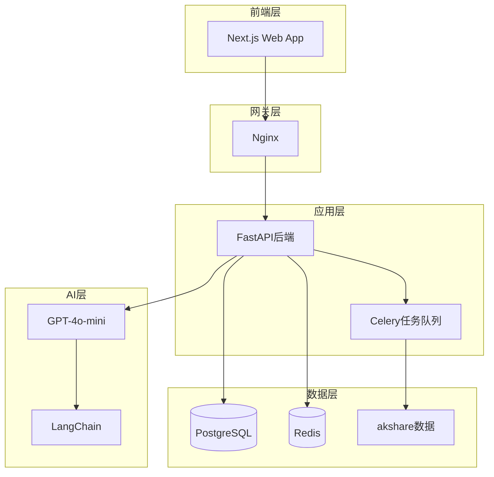
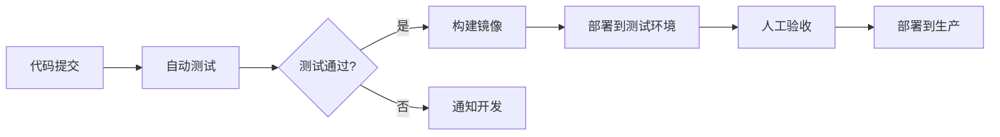

# 技术文档

钱途的技术架构文档,涵盖产品需求、技术方案、数据库设计、API接口等。

## 🏗️ 技术栈

### 前端

- **框架**: Next.js 14 (App Router) + React 18 + TypeScript 5
- **样式**: TailwindCSS 3 + Headless UI
- **状态管理**: Zustand
- **数据请求**: TanStack Query (React Query)
- **图表**: Recharts / ECharts
- **动画**: Framer Motion

### 后端

- **框架**: Python 3.11+ + FastAPI 0.110+
- **数据库**: PostgreSQL 15 + Redis 7
- **ORM**: SQLAlchemy 2.0 + Alembic
- **认证**: JWT + OAuth2
- **任务队列**: Celery + Redis
- **API文档**: FastAPI自动生成Swagger/OpenAPI

### AI层

- **模型**: OpenAI GPT-4o-mini
- **对话管理**: LangChain 0.1+
- **向量数据库**: Qdrant (知识库检索)
- **备选**: DeepSeek / 通义千问

### 数据源

- **A股数据**: akshare
- **美股/港股**: Yahoo Finance (yfinance)
- **备用**: Tushare (需token)

### 部署

- **云服务**: 阿里云ECS (2核4G)
- **Web服务器**: Nginx + Uvicorn
- **容器**: Docker + Docker Compose
- **CI/CD**: GitHub Actions
- **监控**: Prometheus + Grafana

---

## 📁 核心文档

### 产品需求

[产品需求文档 (PRD)](prd.md){ .md-button .md-button--primary }

详细的功能需求和用户故事:
- 核心功能模块
- 用户角色与权限
- 功能优先级
- 用户故事地图

### 技术方案

[技术架构设计](tech-spec.md){ .md-button }

系统架构和技术选型:
- 系统架构图
- 技术选型理由
- 模块划分
- 关键技术点

### 数据库设计

[数据库设计文档](database-design.md){ .md-button }

数据模型和表结构:
- ER图
- 表结构定义
- 索引设计
- 数据迁移策略

### API接口

[API接口文档](api-spec.md){ .md-button }

RESTful API设计:
- 认证接口
- 用户接口
- 课程接口
- 交易接口
- AI接口

---

## 🚀 快速开始

### 开发环境搭建

[开发环境配置指南](dev-setup.md){ .md-button }

从零开始搭建开发环境:
- 前端环境
- 后端环境
- 数据库配置
- 开发工具推荐

### 部署指南

[生产环境部署](deployment.md){ .md-button }

部署到生产环境:
- 服务器配置
- Docker部署
- Nginx配置
- 域名与SSL
- 监控告警

---

## 🔧 技术特点

### 高性能

- **CDN加速**: 静态资源全部走CDN
- **数据库优化**: 合理索引+查询优化
- **缓存策略**: Redis多级缓存
- **异步处理**: Celery异步任务

### 高可用

- **负载均衡**: Nginx反向代理
- **数据备份**: 每日自动备份
- **容错设计**: 优雅降级
- **监控告警**: Prometheus实时监控

### 可扩展

- **微服务架构**: 模块化设计
- **插件系统**: 工具箱可扩展
- **多租户**: 支持企业版
- **国际化**: i18n支持

---

## 📊 系统架构



---

## 🔐 安全设计

### 认证与授权

- **JWT Token**: 无状态认证
- **OAuth2**: 第三方登录
- **RBAC**: 基于角色的权限控制
- **API限流**: 防止滥用

### 数据安全

- **加密存储**: 敏感信息加密
- **HTTPS**: 全站SSL
- **SQL防注入**: ORM参数化查询
- **XSS防护**: 输入输出过滤

---

## 📈 性能指标

### 目标指标

| 指标 | 目标值 | 说明 |
|------|--------|------|
| 页面加载 | <2s | 首屏渲染时间 |
| API响应 | <200ms | P95延迟 |
| 并发用户 | 1000+ | 同时在线 |
| 可用性 | 99.9% | 年度可用性 |

### 监控告警

- **APM**: 应用性能监控
- **日志**: ELK日志分析
- **告警**: 邮件+短信通知
- **Dashboard**: Grafana可视化

---

## 🧪 测试策略

### 测试类型

- **单元测试**: pytest (覆盖率>80%)
- **集成测试**: API测试
- **E2E测试**: Playwright
- **性能测试**: Locust压测

### CI/CD流程



---

## 📚 开发规范

### 代码规范

- **前端**: ESLint + Prettier
- **后端**: Black + Flake8
- **Git**: Conventional Commits
- **分支**: Git Flow

### 文档规范

- **API文档**: OpenAPI 3.0
- **代码注释**: Docstring
- **变更日志**: CHANGELOG.md
- **README**: 中英文双语

---

## 🛠️ 开发工具

### 推荐IDE

- **前端**: VS Code + 插件
- **后端**: PyCharm / VS Code
- **数据库**: DBeaver
- **API测试**: Postman / Insomnia

### 常用命令

```bash
# 前端开发
npm run dev         # 启动开发服务器
npm run build       # 构建生产版本
npm run lint        # 代码检查

# 后端开发
uvicorn main:app --reload  # 启动开发服务器
pytest                      # 运行测试
alembic upgrade head        # 数据库迁移

# Docker
docker-compose up -d        # 启动所有服务
docker-compose logs -f      # 查看日志
```

---

## 📞 技术支持

- **GitHub**: [sine-io/moneypath](https://github.com/sine-io/moneypath)
- **Issues**: [问题反馈](https://github.com/sine-io/moneypath/issues)
- **Wiki**: [技术Wiki](https://github.com/sine-io/moneypath/wiki)

---

**技术栈成熟度**: ⭐⭐⭐⭐⭐  
**开发难度**: 中等  
**预计开发周期**: 3个月(MVP)
